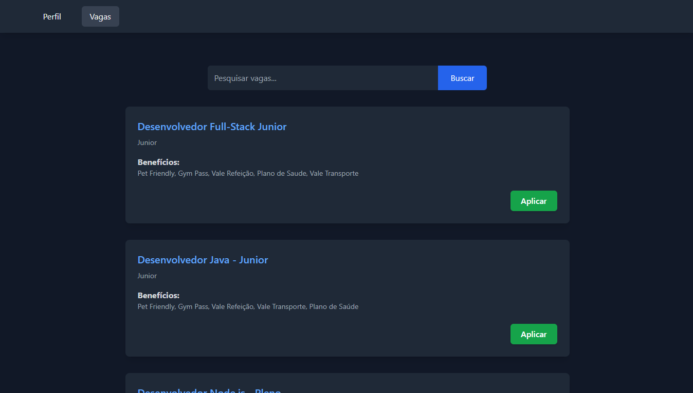

# 💼 Javagas API

**Javagas** é uma plataforma completa para gestão de vagas de emprego, conectando candidatos a oportunidades de forma ágil e eficiente. Candidatos podem criar perfis, buscar e se candidatar a vagas, enquanto empresas publicam oportunidades e gerenciam processos seletivos. Este repositório contém o back-end da aplicação, uma **API RESTful** segura e otimizada, construída com **Java** e **Spring Boot**, garantindo alto desempenho e escalabilidade.

<p align="center">
  
</p>

> 🔗 Este repositório representa a **camada de serviços (back-end)** da aplicação Javagas. Para acessar o front-end, [clique aqui](https://github.com/joschonarth/javagas-web).

## 🛠️ Tecnologias Utilizadas

- ☕ **Java** - Linguagem principal utilizada para desenvolvimento.
- 🌱 **Spring Boot** - Facilita a criação e configuração da API RESTful.
- 📊 **Spring Data JPA** - Simplifica a interação com o banco de dados.
- 🐘 **PostgreSQL** - Banco de dados relacional utilizado para armazenar informações.
- 🐳 **Docker** - Containerização da aplicação para facilitar o desenvolvimento e a implantação.
- 🔄 **Hibernate** - Mapeamento objeto-relacional (ORM) para facilitar as operações no banco de dados.
- 📦 **Maven** - Gerenciador de dependências e automação do build.
- ✨ **Lombok** - Reduz a quantidade de código boilerplate.
- 🔒 **Spring Security** - Implementa autenticação e autorização para controle de acesso.
- 🔑 **Java JWT** - Gera e valida tokens JWT para autenticação segura.
- 📗 **Swagger** - Documentação e testes interativos da API.
- 🧪 **JUnit** - Framework de testes unitários.
- 🛠️ **Mockito** - Cria mocks para testes unitários.
- 🔬 **Jacoco** - Ferramenta para análise de cobertura de código em testes unitários.
- 🔧 **Spring Actuator** - Fornece endpoints de monitoramento e gerenciamento da aplicação.
- 📊 **SonarQube** - Ferramenta para análise da qualidade do código.
- 📈 **Grafana** - Monitoramento e visualização de métricas.
- 📉 **Prometheus** - Coleta e armazenamento de métricas para monitoramento.
- ⚙️ **GitHub Actions** - Automatiza o build, testes e deploy da aplicação.

## ⚙️ Funcionalidades

### 🧑‍💻 Candidato

- 👤 **Criar um candidato**: Registra um novo candidato na plataforma.
- 🔐 **Autenticar candidato**: Realiza o login de um candidato.
- 🔎 **Buscar perfil de um candidato**: Retorna as informações do candidato autenticado.

### 🏢 Empresa

- 🏢 **Criar empresa**: Cadastra uma nova empresa no sistema.
- 🔐 **Autenticar empresa**: Permite que empresas realizem login.

### 💼 Vagas

- 📝 **Criar vaga**: Publica uma nova oportunidade de emprego.
- 📋 **Listar vagas**: Retorna todas as vagas disponíveis na plataforma.

## 🚀 Como Executar o Projeto

1. **Clone o repositório:**

   ```bash
   git clone https://github.com/joschonarth/javagas-server.git
   ```

2. **Entre no diretório do projeto:**

   ```bash
   cd javagas-server
   ```

3. Inicie o banco de dados **PostgreSQL** utilizando o container **Docker** com a imagem ``bitnami/postgresql``:

   ```bash
   docker-compose up -d
   ```

4. **Inicie a API:**

   ```bash
   mvn spring-boot:run
   ```

   - 🚀A aplicação estará disponível em [http://localhost:8080](http://localhost:8080).
   - 📜 Acesse a documentação da API em [Swagger UI](http://localhost:8080/swagger-ui.html).

## 📡 Rotas da Aplicação

### 🧑‍💻 Rotas do Candidato

#### 👤 Criar Candidato

- **Descrição:** Registra um novo candidato na plataforma.
- **Método:** ``POST``
- **URL:** ``/candidate``
- **Corpo da Requisição:**

```json
{
    "username": "johndoe",
    "name": "John Doe",
    "email": "johndoe@example.com",
    "password": "123456",
    "description": "Full-Stack Developer"
}
```

- **Exemplo de Resposta:**

```json
{
    "id": "f94999c1-8a00-4bc2-a09b-e22dc8b7f090",
    "name": "John Doe",
    "username": "johndoe",
    "email": "johndoe@example.com",
    "description": "Full-Stack Developer",
    "curriculum": null,
    "createdAt": "2025-03-12T18:41:29.993736"
}
```

#### 🔐 Autenticar Candidato

- **Descrição:** Realiza o login de um candidato.
- **Método:** ``POST``
- **URL:** ``/candidate/auth``
- **Corpo da Requisição:**

```json
{
    "username": "johndoe",
    "password": "123456"
}
```

- **Exemplo de Resposta:**

```json
{
    "access_token": "eyJhbGciOiJIUzI1NiIsInR5cCI6IkpXVCJ9...",
    "expires_in": 1741816312251,
    "roles": [
        "CANDIDATE"
    ]
}
```

#### 🔎 Buscar Perfil de Candidato

- **Descrição**: Retorna as informações do candidato autenticado.
- **Método**: ``GET``
- **URL**: ``/candidate``

- **Exemplo de Resposta:**

```json
{
    "description": "Full-Stack Developer",
    "username": "johndoe",
    "email": "johndoe@example.com",
    "id": "f94999c1-8a00-4bc2-a09b-e22dc8b7f090",
    "name": "John Doe"
}
```

### 🏢 Rotas da Empresa

#### 🏢 Criar empresa

- **Descrição**: Cadastra uma nova empresa no sistema.
- **Método**: ``POST``
- **URL**: ``/company``
- **Corpo da Requisição**:

```json
{
    "username": "company_user",
    "password": "123456789",
    "email": "contact@company.com",
    "name": "Generic Company",
    "website": "http://www.company.com",
    "description": "Innovative technology company"
}
```

- **Exemplo de Resposta:**

```json
{
    "id": "4a56ab16-8c28-44ac-9d62-70df265ec121",
    "name": "Generic Company",
    "username": "company_user",
    "email": "contact@company.com",
    "website": "http://www.company.com",
    "description": "Innovative technology company",
    "createdAt": "2025-03-12T18:45:51.982318"
}
```

#### 🔐 Autenticar Empresa

- **Descrição**: Permite que empresas realizem login.
- **Método**: ``POST``
- **URL**: ``/company/auth``
- **Corpo da Requisição**:

```json
{
    "username": "company_user",
    "password": "123456789"
}
```

- **Exemplo de Resposta:**

```json
{
    "access_token": "eyJhbGciOiJIUzI1NiIsInR5cCI6IkpXVCJ9...",
    "expires_in": 1741823290214,
    "roles": [
        "COMPANY"
    ]
}
```

### 💼 Rotas de Vagas

#### 📝 Criar Vaga

- **Descrição**: Publica uma nova oportunidade de emprego.
- **Método**: ``POST``
- **URL**: ``/company/job``
- **Corpo da Requisição**:

```json
{
    "description": "Job opening for Full-Stack Developer",
    "benefits": "Pet Friendly, Gym Pass, Meal Voucher, Health Plan, Dental Plan",
    "level": "Junior"
}
```

- **Exemplo de Resposta:**

```json
{
    "id": "0ba90db2-40fc-4823-99e4-f4a894bd135e",
    "description": "Job opening for Full-Stack Developer",
    "benefits": "Pet Friendly, Gym Pass, Meal Voucher, Health Plan, Dental Plan",
    "level": "Junior",
    "companyEntity": null,
    "companyId": "4a56ab16-8c28-44ac-9d62-70df265ec121",
    "createdAt": "2025-03-12T18:49:15.798243"
}
```

#### 📋 Listar Vagas

- **Descrição**: Retorna todas as vagas disponíveis na plataforma.
- **Método**: ``GET``
- **URL**: ``/company/job``

- **Exemplo de Resposta:**

```json
[
    {
        "id": "0ba90db2-40fc-4823-99e4-f4a894bd135e",
        "description": "Job opening for Full-Stack Developer",
        "benefits": "Pet Friendly, Gym Pass, Meal Voucher, Health Plan, Dental Plan",
        "level": "Junior",
        "companyEntity": {
            "id": "4a56ab16-8c28-44ac-9d62-70df265ec121",
            "name": "Generic Company",
            "username": "company_user",
            "email": "contact@company.com",
            "website": "http://www.company.com",
            "description": "Innovative technology company",
            "createdAt": "2025-03-12T18:45:51.982318"
        },
        "companyId": "4a56ab16-8c28-44ac-9d62-70df265ec121",
        "createdAt": "2025-03-12T18:49:15.798243"
    }
]
```

## 🌐 Front-End

O back-end do **Javagas** se comunica com a aplicação front-end, que é responsável pela interface do usuário e interação com os candidatos e empresas. Você pode acessar o repositório do front-end aqui:

👉 [Javagas Front-End](https://github.com/joschonarth/javagas-web)

A interface permite que candidatos se inscrevam, empresas publiquem vagas e usuários naveguem pelas oportunidades de emprego de forma intuitiva.

### 🧪 Testes

O projeto contém testes utilizando **JUnit** e **Mockito**, com o banco de dados em memória **H2** configurado para rodar os testes em um ambiente isolado.

Para executar os testes, siga as instruções abaixo:

1. Certifique-se de que você tem o **JDK 11 ou superior** instalado.
2. Abra o terminal e navegue até o diretório raiz do projeto.
3. Execute o seguinte comando para rodar os testes:

```bash
mvn test
```

Este comando irá rodar todos os testes configurados no projeto, utilizando o banco de dados **H2** em memória para garantir que os testes sejam executados em um ambiente isolado e sem afetar os dados de produção.

### 📊 Monitoramento com Prometheus e Grafana  

A aplicação conta com um sistema de **monitoramento contínuo** utilizando **Prometheus** e **Grafana**, proporcionando visibilidade sobre métricas essenciais, como uso de recursos, tempo de resposta e status da API.  

- **Prometheus** é responsável pela coleta e armazenamento das métricas expostas pela aplicação através do endpoint [`http://localhost:8080/actuator/prometheus`](http://localhost:8080/actuator/prometheus).  
- **Grafana** permite a visualização dessas métricas em **dashboards interativos**, facilitando a análise de desempenho e detecção de problemas.  

Para iniciar os serviços de monitoramento, basta executar o seguinte comando na raiz do projeto:  

```bash
docker-compose up -d
```

Após a execução, os serviços estarão disponíveis nos seguintes endereços:  

- **Prometheus**: [`http://localhost:9090`](http://localhost:9090)  
- **Grafana**: [`http://localhost:3000`](http://localhost:3000) (Login padrão: `admin` / `admin`)  

Com isso, você pode monitorar o desempenho da API em tempo real e configurar **dashboards personalizados** no Grafana conforme necessário.

## ⚙️ GitHub Actions

O projeto utiliza o **GitHub Actions** para automação do processo de build e deploy. Sempre que um novo commit é enviado para a branch `main`, o pipeline é acionado para realizar as seguintes etapas:

- **Checkout do código**: Obtém a versão mais recente do repositório.  
- **Configuração do ambiente**: Instalação do Java 17 e do Maven.  
- **Build do projeto**: Executa `mvn clean install` para compilar e validar o código.  
- **Autenticação no Docker Hub**: Login utilizando as credenciais armazenadas nos `secrets`.  
- **Criação da imagem Docker**: Gera uma imagem Docker do projeto.  
- **Publicação da imagem**: Faz o push da imagem para o Docker Hub.

Essa automação garante que o código esteja sempre atualizado e pronto para ser implantado de forma contínua. 🚀

## 🤝 Contribuições

Contribuições são bem-vindas! Sinta-se à vontade para abrir issues ou pull requests com melhorias ou correções.

## 📞 Contato

[](https://www.linkedin.com/in/joschonarth/)
[](mailto:joschonarth@gmail.com)
